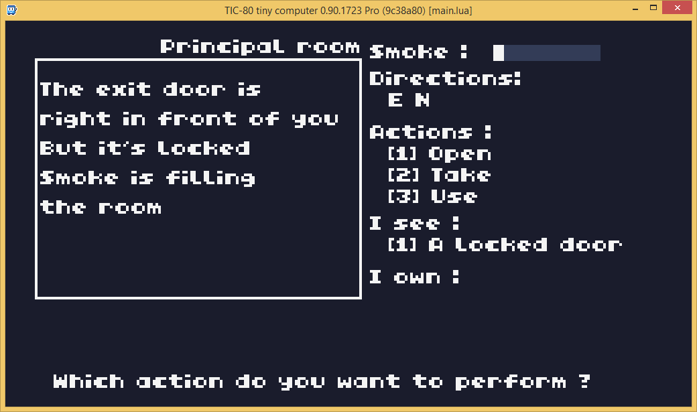
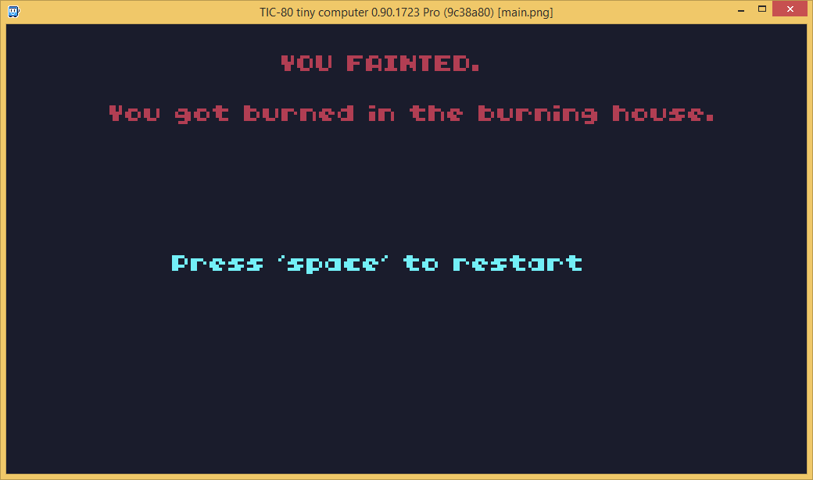
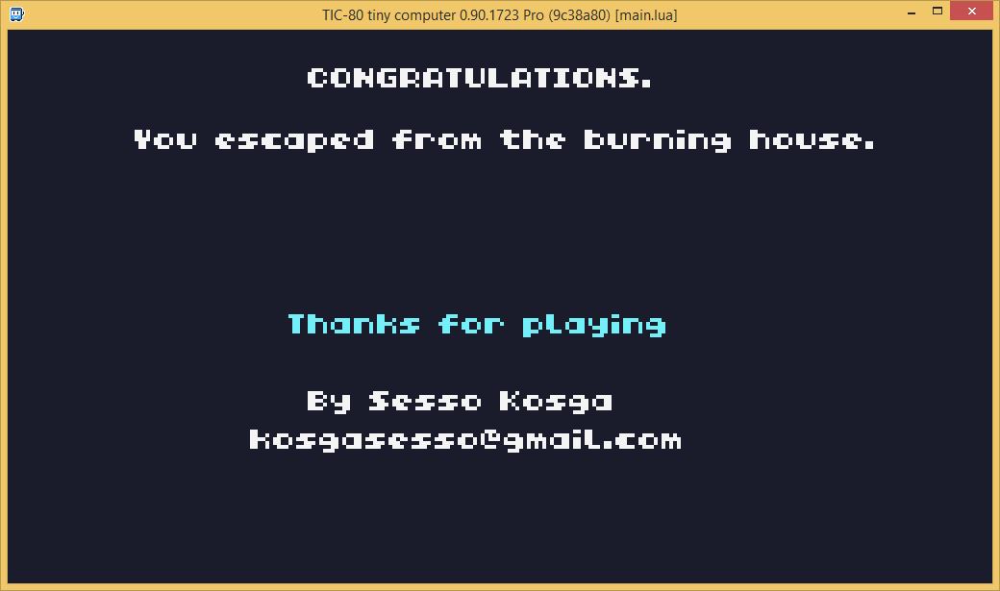

# Fire Escape

A Text based Adventure Game.

Made for the [Linux Game Jam 2022](https://itch.io/jam/linux-game-jam-2022)

### Theme : There is no theme

### Language / Framework: Lua / TIC-80
### Get on itch.io : [https://senor16.itch.io/fireescape](https://senor16.itch.io/fireescape)
### Get on TIC 80 store : [https://tic80.com/play?cart=2774](https://tic80.com/play?cart=2774)
### Controls :

Arrow keys, E,W,N,S to change rooms

### Code : by me

### Graphism : None

### Development duration : 5h25min

### Post mortem

It's a very unique experience when making a game using a fantasy console. It's limitations make you discover new ways of doing things.
I'm very proud that I gaveit a try.

### Screenshots

by Sesso Kosga kosgasesso@gmail.com
